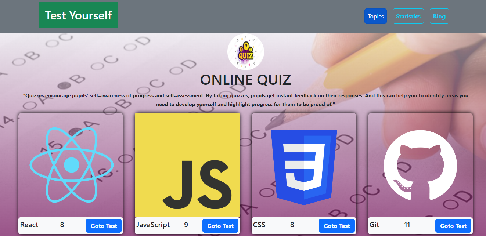
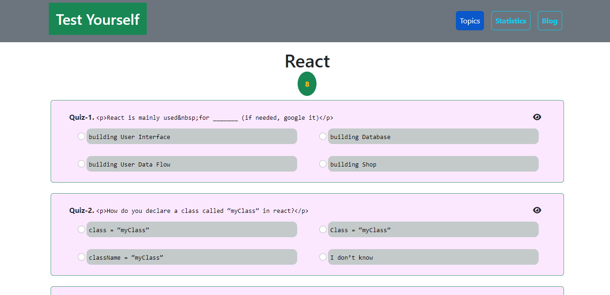
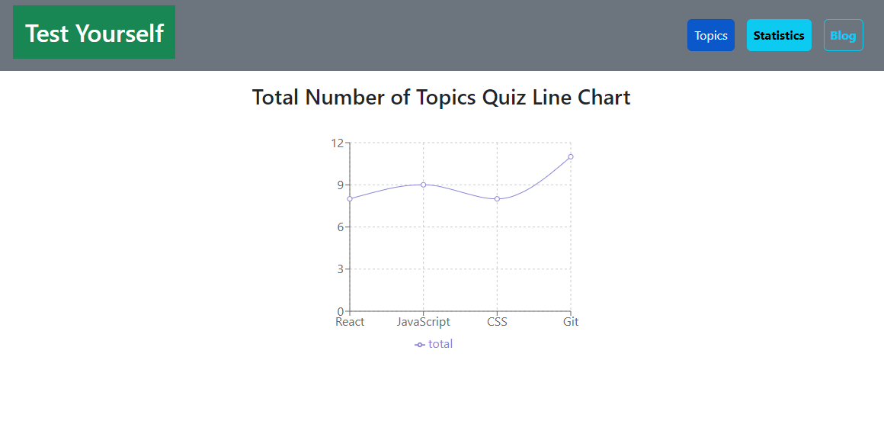
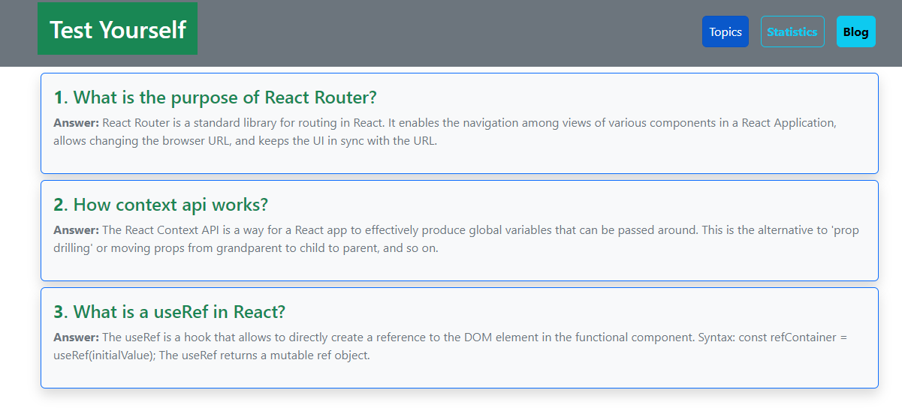

## Project Name

### Test Yourself

React.js Web Application for practicing with multiple topics quizzes.

## Project Status

This project is currently in development. Users can Perform the four different topics quiz test and also see the correct answer. Functionality has been used to show correct or wrong messages toast based on user selection activity.
Another feature I have shown is the topics quiz data in a chart on the statistic page, and some blog posts have been shown on a Blog page.

## Project Screen Shot(s) 

<h3>Main Page and Quiz Page</h3>

  
  

<h3>Another Feature page</h3>

  
  

# quiz-API information

## QUIZ API LINK: 
Get all quiz topics: https://openapi.programming-hero.com/api/quiz

Get topic details by topic id: https://openapi.programming-hero.com/api/quiz/${id}

Example: https://openapi.programming-hero.com/api/quiz/1

## Installation and Setup Instructions 

Clone down this repository. You will need `node` and `npm` installed globally on your machine.  

Installation:

`npm install`  

To Run Test Suite:  

`npm test`  

To Start Server:

`npm start`  

To Visit App:

`localhost:3000`  

Live site:

https://check-yourself.netlify.app
